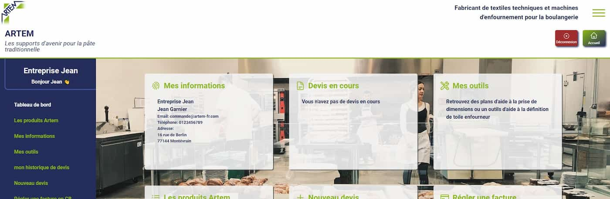

# artem-website

<!-- PROJECT LOGO -->
 

 
  <h3 align="center">ARTEM Website</h3>

  

    Frontend application
     
    using :

[![API][API-shield]][API-url]

 

  
Table of Contents

  <ol>
    <li>
      <a href="#about-the-project">About The Project</a>
    </li>
    <li>
      <a href="#built-with">Built With</a>
    </li>
    <li><a href="#objectives">Iterface features</a></li>
    <li><a href="#contact">Contact</a></li>
  </ol>

 
## About The Project

This Frontend application is a modern user interface interacting with a database through an API. The interface allows users to learn about the Artem company and its products. Additionally, users can create an account to conduct searches for specific products, generate quotes, and/or place orders. Prices a

(<a href="#readme-top">back to top</a>)

## Built With
 

* [![React][React.js]][React-url]
* [![Sass][Sass]][Sass-url]
* [![Git][Git]][Git-url]
* [![Vite][Vite]][Vite-url]
* [![Axios][Axios]][Axios-url]

(<a href="#readme-top">back to top</a>)

## Interface features
The interface provides the user with a wealth of information, most of which is stored in the database.
Here is what can be done:

**Without account :**
- learn about the company, its history, contacts and range
- Create an account
- read the general terms and conditions, legal notices and privacy policy

**With an account and after login :**
- Use products definition tool
- consult all the range's products and do advanced searches
- edit your quotes yourself
- place orders

## Contact 
[![LinkedIn][linkedin-shield]][linkedin-url] 
  
Romain Delchie - 
romaindelchie@yahoo.fr

(<a href="#readme-top">back to top</a>)

[API-shield]: https://img.shields.io/badge/Repo-gree?style=for-the-badge&logo=node.js&label=NODE.JS%20API
[API-url]: https://github.com/Romain-Delchie/artem-server
[linkedin-shield]: https://img.shields.io/badge/-LinkedIn-black.svg?style=for-the-badge&logo=linkedin&colorB=blue
[linkedin-url]: https://linkedin.com/in/romain-delchie
[React.js]: https://img.shields.io/badge/React-20232A?style=for-the-badge&logo=react&logoColor=61DAFB
[React-url]: https://reactjs.org/
[Sass]: https://img.shields.io/badge/Sass-CC6699?style=for-the-badge&logo=sass&logoColor=white
[Sass-url]: https://sass-lang.com/
[Git]: https://img.shields.io/badge/GIT-E44C30?style=for-the-badge&logo=git&logoColor=white
[Git-url]: https://git-scm.com/
[product-screenshot]: images/logo.jpg
[VITE]: https://img.shields.io/badge/VITE-orange?style=for-the-badge
[VITE-url]: https://vitejs.dev/
[AXIOS]: https://img.shields.io/badge/AXIOS-grey?style=for-the-badge
[AXIOS-url]: https://axios-http.com/fr/docs/intro

